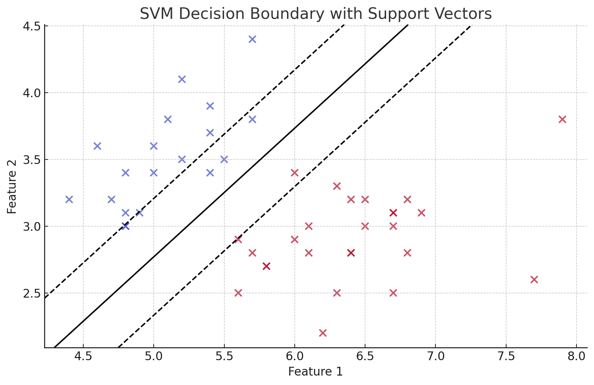

### Отчет по практической работе №5: Метод опорных векторов (SVM)

---

### Задача 1: Пример классификации на наборе данных Iris

#### Формулировка задачи
Используемый набор данных — **Iris** из библиотеки `scikit-learn`. Задача заключается в классификации цветков двух классов на основе двух признаков (длина и ширина чашелистика) с целью построения модели для разделения данных на основе метода опорных векторов.

#### Подход к решению
1. **Выбор данных**: Из набора данных Iris выбраны два признака для визуализации данных на плоскости.
2. **Разделение на обучающую и тестовую выборки**: Данные разделены на 70% для обучения и 30% для тестирования.
3. **Обучение модели SVM**: Модель была обучена с линейным ядром и параметром регуляризации `C=1.0`.
4. **Предсказание и оценка**: Модель была протестирована на тестовой выборке, и вычислены метрики точности.

#### Код программы
```python
from sklearn import datasets
from sklearn.svm import SVC
from sklearn.model_selection import train_test_split
from sklearn.metrics import classification_report, accuracy_score

# Загрузка данных Iris
iris = datasets.load_iris()
X = iris.data[:, :2]  # Используем два признака для визуализации
y = iris.target
y_binary = y.copy()
y_binary[y_binary == 2] = 1  # Преобразование к задаче бинарной классификации

# Разделение данных на обучающую и тестовую выборки
X_train, X_test, y_train, y_test = train_test_split(X, y_binary, test_size=0.3, random_state=42)

# Обучение модели SVM с линейным ядром
svm_model = SVC(kernel='linear', C=1.0)
svm_model.fit(X_train, y_train)

# Предсказание на тестовой выборке
y_pred = svm_model.predict(X_test)

# Оценка модели
report = classification_report(y_test, y_pred)
accuracy = accuracy_score(y_test, y_pred)
```

#### Графическое решение
На графике ниже отображены данные, граница принятия решений, разделяющая классы, а также опорные векторы. Опорные векторы, используемые для построения границы, отмечены кругами без заливки.

#### Результаты
- **Точность**: 100%
- **Отчет классификации**:
  ```
                    precision    recall    f1-score    support
 
                0   1.00         1.00      1.00        19
                1   1.00         1.00      1.00        26
 
    accuracy                               1.00        45
    macro avg       1.00         1.00      1.00        45
    weighted avg    1.00         1.00       1.00        45
  ```

---